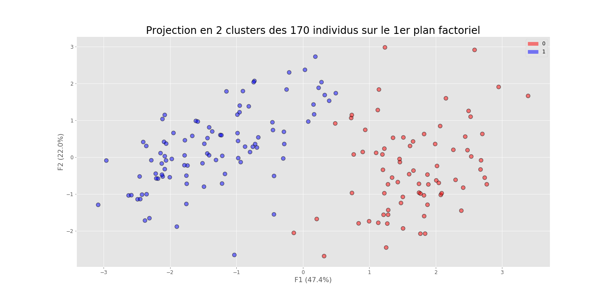

# Projet : Détectez des faux billets
### Projet du parcours Data Analyst OpenCmassrooms réalisé avec l’ENSAE-ENSAI.
Création d'un algorithme de détection de faux billets.



### Scénario :
Société de consulting informatique *(préférant garder l'anonymat)*, un nouveau contrat au [Ministère de l'Intérieur](https://www.interieur.gouv.fr/) a été remporté. Cette nouvelle mission intervient dans le cadre de la lutte contre la criminalité organisée, à [l'Office central pour la répression du faux monnayage](https://www.police-nationale.interieur.gouv.fr/Organisation/Direction-Centrale-de-la-Police-Judiciaire/Lutte-contre-la-criminalite-organisee/Office-central-pour-la-repression-du-faux-monnayage). La mission est d'intérêt public, élaborer un algorithme de détection de faux billets. Un seul mot d'ordre : **Traquer la moindre fraude!**

## Préambule
Pour ce projet, les données ont été manipulées en Python. Mise en oeuvre d'une analyse de **statistique descriptive**, ainsi qu'une **analyse en composantes principales**, une **classification automatique**, et une modélisation de type **régression logistique**.

### Les données
*Data source* [Office central pour la répression du faux monnayage](https://s3-eu-west-1.amazonaws.com/static.oc-static.com/prod/courses/files/parcours-data-analyst/notes.csv)

### Compétences évaluées
 - Interpréter une ACP
 - Modéliser grâce à la régression logistique
 - Réaliser une ACP
 - Utiliser un algorithme de clustering de type Kmeans


## Prérequis techniques
Si vous n'avez jamais installé **Python**, alors autant installer directement la **distribution Anaconda**.
Anaconda est donc une distribution Python, faite pour la Data Science.

De cette manière on peut installer Python et ses librairies de Data Science Pandas, Matplotlib, Scipy, Numpy etc… 
Mais aussi le notebook Jupyter, qui reste incontournable et vivement recommandé!
C'est par ici : [Anaconda](https://www.anaconda.com/download)

Si vous souhaitez lancer le projet, il sera nécessaire d'installer Jupyter Notebook sur votre mahcine. 
La doc. Jupyter est accessible via : [Jupyter Documentation](https://jupyter.readthedocs.io/en/latest/install.html) 

```
python -m pip install --upgrade pip    
python -m pip install jupyter
```

Pour tester l'installation, vous pouvez taper dans votre console la commande suivante :

```
jupyter notebook
```

### Installation des librairies Python uniquement
*Pour installer python ainsi que les librairies de Data Science, il est fortement recommandé d'installer la distribution Anaconda.* 

```
pip install pandas
pip install matplotlib
pip install numpy
pip install scipy
```

## Auteur

**Nalron** *(Nicolas Pasero)* [Persona](https://nalron.com) - *Initial work* - [Github](https://github.com/nalron)

